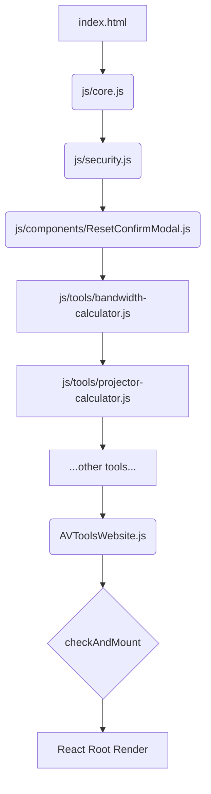

# AV Tools Pro: Technical Architecture

This document outlines the architectural strategy used for the AV Tools Pro website refactor (Feb 2026).

## 1. Modularization Strategy: "Vertical Slice"

To maintain compatibility with legacy browsers and satisfy the "No Build Tools" requirement while improving maintainability, the application uses a **Global Scope Script Concatenation** pattern with a **Vertical Slice** organization.

Each tool (calculator) is contained within a single file that holds both its mathematical logic and its React UI component.

### Load Order Diagram

## 2. Page Refresh Architecture (Ad Optimization)

The application has moved away from a Single Page Application (SPA) routing model to a **Standard Multi-Page Navigation** model via URL Query Parameters.

- **URL Pattern:** `avtoolspro.com/?tool=bandwidth`
- **Mechanism:** When a user clicks a tool link, the browser performs a full HTTP request and page reload.
- **Benefit:** This forces a refresh of the Google AdSense units on every navigation, maximizing ad impressions and revenue per session.

## 3. Component Hierarchy

1.  **React Globals:** Provided via Unpkg CDN.
2.  **Core Layer:** Defines the `_jsx` and `_jsxs` primitives used by the React components.
3.  **Tool Layer (`js/tools/`):** 16 independent files. Each file defines:
    *   A global math function (e.g., `calculateBandwidth`).
    *   A global React component (e.g., `BandwidthCalculator`).
4.  **Shell Layer:** The `AVToolsWebsite` component which manages the overall layout, theme, and routing.

---
*Prepared by Antigravity AI - Google DeepMind*
