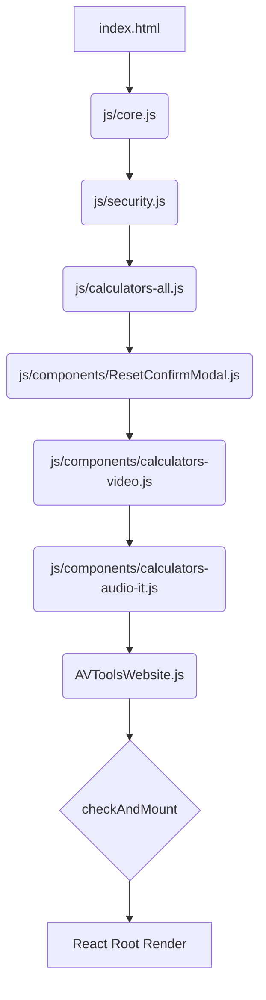

# AV Tools Pro: Technical Architecture

This document outlines the architectural strategy used for the AV Tools Pro website.

## 1. Modularization Strategy: "Smart Separation"

To maintain compatibility with legacy browsers and satisfy the "No Build Tools" requirement, the application uses a **Global Scope Script Concatenation** pattern. 

Unlike modern ES Modules (`import/export`) which require a local server and build steps, this approach loads scripts sequentially in the global memory space.

### Load Order Diagram

## 2. Navigation & State Architecture

The application uses a hybrid approach to routing and state management to balance AdSense revenue with User Experience.

### A. Tool Navigation (Full Reloads)
- **Mechanism:** `window.location.href = "/?tool=bandwidth"`
- **Why:** Forces a full page refresh when switching between main tools.
- **Benefit:** Triggers new Google AdSense impressions for every tool usage, maximizing revenue potential.

### B. App State (React Managed)
- **Mechanism:** `useState` and `useEffect` within `AVToolsWebsite.js`.
- **Scope:** Handles Theme (Dark/Light), Mobile Menu toggles, and internal calculator values.
- **Benefit:** Switching themes or interacting with a calculator happens instantly without reloading the page, preserving the user's input data.

## 3. Component Hierarchy

1.  **React Globals:** Provided via Unpkg CDN (`React`, `ReactDOM`).
2.  **Core Layer (`js/core.js`):** 
    - Defines `_jsx` and `_jsxs` primitives (replacing Babel).
    - Exposes hooks (`useState`, `useEffect`) globally.
    - Provides utility functions (`_0x99bba9` for safe number parsing).
3.  **Logic Layer (`js/calculators-all.js`):** 
    - Pure JavaScript functions containing all mathematical formulas.
    - Completely decoupled from the UI.
4.  **UI Layer (`js/components/*.js`):** 
    - React functional components that handle user input and display results.
5.  **Shell Layer (`AVToolsWebsite.js`):** 
    - **Routing:** Detects `?tool=` query parameters on mount.
    - **Theme Engine:** Manages Light (Default) vs Dark mode persistence via `localStorage`.
    - **Layout:** Renders the responsive header, footer, and active tool.

---
*Prepared by Antigravity AI - Google DeepMind*
